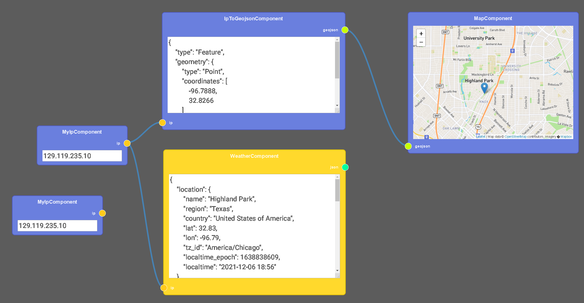
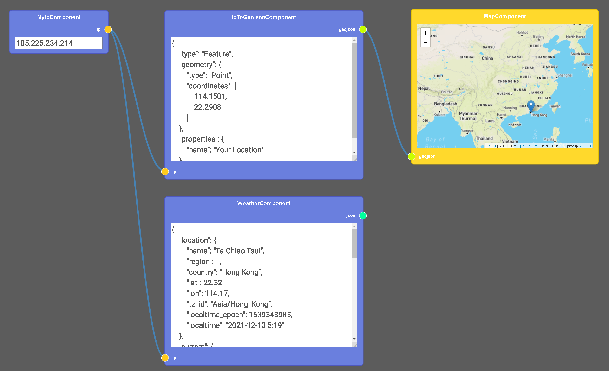
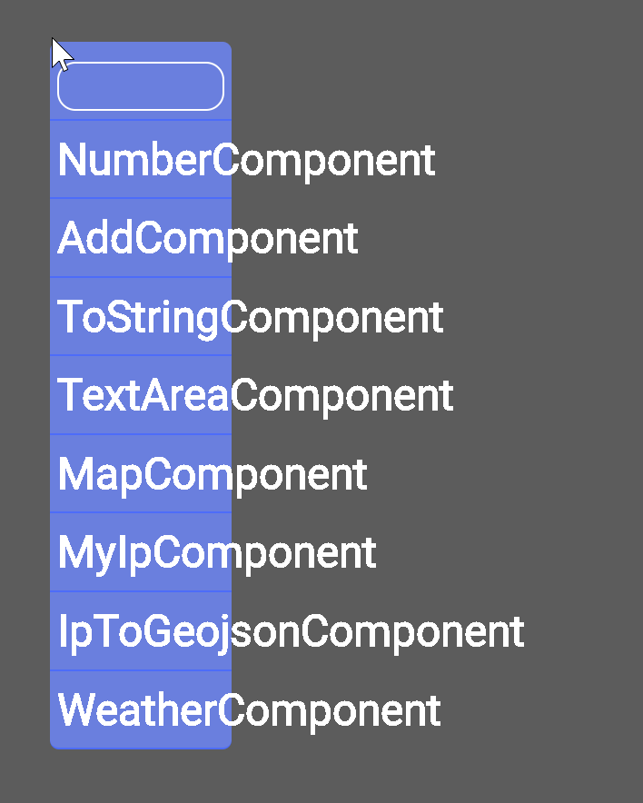
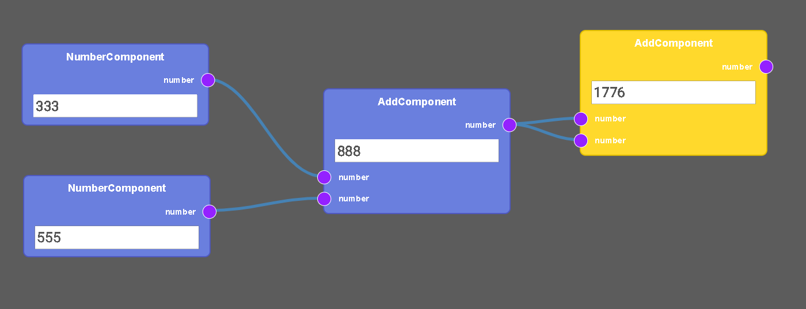
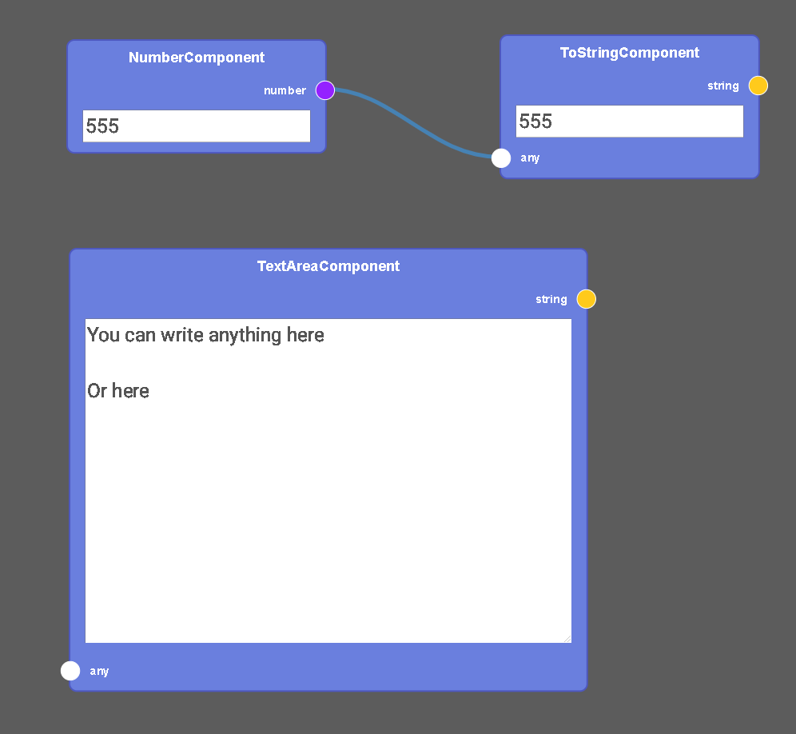

<h1 style='text-align: right'> Fall 2021 </h1>

> # Technical Report

## 
 Team Members: Nahed Abdelgaber, Hongjin Yu 
 
## 
 Instructor: Professor Jia Zhang 
 
Enclosed in this document is the technical report of CS8391 Service-Oriented Software Engineering

## 
 Computer Science Department 

## 
 Southern Methodist University 

### Technical Report 
 Mashup Playground' 

## Table of Contents

### 1.	[Introduction](#Introduction)
### 2.	[Motivation](#Motivation)
### 3.	[Related work](#Related)
### 4.	[Design](#Design)
### 5.	[System implementation](#System)
### 6.	[Experiments/Analysis](#Experiments)
### 7.	[Known issues, bugs, problems](#Issues)
### 8.	[Conclusions and recommended future work](#Conclusions)
### 9.	[Documentation](#Documentation)

## 1. Introduction 

We aim to create a customizable homepage for users that allows users to create their own mashups using Visual Programming. Users will be able to choose from different data sources / APIs and transform / display the data on their homepage. The product is targeted towards non-technical users, users will not need to know or care about any technologies under the hood: programming languages, servers, API communications, databases, authentication, html/css, etc. In terms of ease of use, think of a Facebook page, 8 year olds and grandmothers can use Facebook, our goal is that they should also be able to use our platform to build mashups. In terms of customizability, think of a physical desktop, where the user can put anything anywhere. Moving objects is intuitive and liberating. We think that the user should be able to turn their homepage into anything they want (in terms of both form and function).

## 2. Motivation 

### First observation: 

Facebook, Youtube, Netflix, Instagram etc, push content to users and decide what users should see based on algorithm and user's past history.

This has several problems:

1) Algorithms will give the user 'junk food' style content, politically polarizing content, content that satisfies the user's short term compulsions but usually don't facilitate long term personal growth. This is further exacerbated by the trend of content creators chasing the algorithms so their content becomes more sensational and less wholesome overtime.

2) When algorithm make mistakes and give the user what they do not want, there is usually no way for user to direct content explicitly. Some services allow for users to provide feedback to the algorithm, but rules are always opaque.

3) Targeted ads and such are based off of user data collection, which have a multitude of problems. Privacy, unwanted products, exposing embarrassing life circumstances etc.

4) Users often want certain content to always show, and/or prioritize their content. For example they have a best friend and they will always leave a reply to that friend's posts. Or they want a section of their page to report the current score of a sports match. Or they want to track covid numbers / stock index etc. Current algorithm curated content will often push irrelevant content to the top and users must 'hunt' for content they really want. 

### Second observation:

  Users will often have several favorite websites / platforms that they visit and switch between every day. However, most of the content on the website is noise to the user, and they really only care about a small fraction of the content.
- To solve the frequently used website problem, users have used the following strategies:
  - Pinning browser tabs
  - Having the sites bookmarked and reopen them every time manually / automatically on browser start
  - Browser plugins that take snapshots of the sites
- The above strategies are ad hoc and are not using a tool optimized for the requirement.
- There is no way for users to filter out noise.

### Third observation:

Many platforms have an ecosystem of software and services that provide the user with great value. However the software on each platform is always slightly different, with slightly different features and UI. The user has to context switch and relearn the same software multiple times. Take the simplest example, a weather app on windows and android. Both convey the same information yet each one has a different layout, and different ways to navigate. 

### Forth observation:

- APIs are often either simple, but poorly documented, or complex and over-engineered with documentation that can fill books.  
- APIs from different companies often use different documentation notation, different authentication methods, different calling conventions, etc. 
    - For example Twitter and Google API use completely different authentication methods.
    - Twitter API can not be called from a browser (frontend)
    - Google forces developers to go through a very long process of registering, verification, configuration before calling the simplest of their APIs.
- To build a Mashup, often several APIs need to be called. Learning the quirks for all can be time consuming and challenging. 
- To exacerbate the problem, companies often 'upgrade' their api, making developers learn the new conventions all over again.
- In summary, using an API is harder that is **should** be.

### What we aim to solve

The above observations suggest that there is a niche in the market that is not being fulfilled, the product should meet the following requirements:

- Self directed. 
  - Users are fed up by being fed. Users should be able to choose, with granularity what content they want to see.
  - Self directed also serves as a noise filter. Users constantly being fed by what the algorithm thinks will interest them will indeed keep their eyes glued to the screen in the short term, but will often lead to burnout in the long term.
- Ease of use.
    - Node based visual programming.
    - Only node sockets of matching types can be connected. 
    - Control flow is visual and intuitive.
    - Data flowing through sockets can be inspected.
    - Nodes that give visual representation of complex data.
    - APIs just work. APIs are represented as Nodes, with input / output. Little to no configuration to call an API.
    - All APIs have a working example that the user can reference / modify.
- Content aggregation. 
  - Today, users' attention is becoming fragmented. Users need to 'hunt' for the same content they want every day (opening up several different sources, navigating, filtering out noise). 
  - Content should come to the user, when the user wants it, in the format the user wants, without additional baggage.
  - User should feel like a president or a CEO. Information flowing to them should be filtered and organized as if by a personal secretary. Instead, users today feel like slaves with multiple masters. Platforms ensnare users with social, psychological and biological pressures, and users are compelled to hunt for information on different platforms, with different rules and bombarded with noise.
- Fully customizable layout and priorities. 
  - User should be able to set content priority instead of letting AI choose.
  - User organizes things the way they want to, and they stay that way.
- Unified experience between platforms. 
  - Don't force the user to context switch to different platforms.

## 3. Related work 

### parabola.io

- https://parabola.io/
- The UI and Visual Programming component is similar to what we propose, however they have a different target audience.
- At a high level, their app allows:
    -  Pulling data from APIs
    -  Storing the data in a data table similar to excel
    -  Providing Visual Programming to manipulate data tables
    -  Export data tables to API
- Focused on data gathering and reporting.
    - Sales reporting.
    - Marketing Reporting.
    - Customer Management.
    - Inventory Management.
- Nodes are very hight level.
    - Easy to visualize general data flow.
    - Connection between nodes do not show data type / assumed to be data tables.

### scriptable.app

- https://scriptable.app/
- Automate tasks by using javascript and calling APIs.
- iOS only.
- No Visual Programming.

### Visual APIs

- https://vap.is/
- From their description they aim to achieve something similar to us.
- No actual working examples.
- Everything on website is "Coming Soon…"

### Rapid API

- https://rapidapi.com/
- Allows for easy testing of APIs
- Most examples work out of box
- Targeted toward API discovery / documentation / testing
- No scripting component

### Android widgets 
- There is a widget for everything that shows you information you want on your android home screen. For example the author has one that directly controls his audio book player, and another that tracks stocks / cryptocurrencies.
- This is the most similar technology to what we want.
- We are different because we are using web technology, so the user will have a unified experience across platforms. e.g. logging in to the website with their phone / pc / mac / smart TV will show the same (responsive) content. Switching devices will not interrupt user experience.
- Android widgets is more limited as it must fit in one page and must adhere to android UI conventions.
- Android widgets is really out of place living in the same space as apps.

### Windows start menu and widgets
- Same concept as android widgets 
- Platform dependent
- Poor ecosystem. No developers -> no users -> no developers -> no users -> ...
- We are using web technology which already has a good ecosystem.

### Browser homepage plugins
- Various browsers have plugins that allow the homepage to be customized to show snapshots of favorite websites.
- The website snapshots are limited in usefulness. A shrunken down snapshot of a website does not usually convey information a user really wants.

### Social media aggregation websites
- These are usually geared toward content creators to keep track / push to all sites, and for data analytics.
- Not geared toward content consumers.
- Not easy to use.

### RSS Feeds

- Not user friendly to set up
- Requires software

## 4. Design 

- Design Goal: Present APIs to non-technical users in a easy to digest manner. 
- Users are presented with a 'homepage'.
- Users can create Nodes by right-clicking and selecting a Node type.
- Nodes can represent APIs or programming functions. 
- Nodes have input and outputs, with the datatype color coded.
    - Only datatypes that are the same can be connected.
- There are also Nodes that provide programming functionality, that take an input, manipulate the data, and output data.
- Users program by simply connecting Nodes.
- User can connect APIs and manipulate data from APIs using node based Visual Programming.
- User gets to enjoy personalized, self directed content from a myriad of sources in a single place.

## 5. System implementation 

### Development Environment
- Our app is created and hosted on `anvil.works`
- https://anvil.works/
- This is a full stack python solution that includes:
    - Database: Fully managed PostgreSQL database, can be accessed with normal python syntax. (Similar to ebean for java)
    - Backend: Python functions
        - Can expose functions as API routes / endpoints
    - Frontend: Python that compiles to javascript
        - Frontend can directly call backend functions without needing to use routes (though using routes is also possible). 
    - Graphical Frontend UI designer.
        - WYSIWYG
    - Online code editor.
        - At first we were hesitant about this feature, since online code editors have usually been laggy and unintuitive, most developers would rather stick with their familiar IDE that is on their local machine. However, we found many advantages to the online code editor that makes it very practical.
        - Frontend intellisense is aware of backend functions.
        - Frontend intellisense is aware of database column names and types.
        - Frontend intellisense is aware of UI elements.
- We chose Anvil for it's ease of use.
    - Only one programming language needed across the whole stack - Python.
    - No need to learn javascript, html, css, database query language, etc.
    - Easy and free hosting.
    - In practice, only took 5 minutes to walk through and deploy the tutorial app to the internet.

### Visual Programming Library
- For Visual Programming we did not make our own solution, and decided to use a popular javascript Visual Programming library: `rete.js`
- https://rete.js.org/
- https://github.com/retejs/rete
- With over 7k stars on github, it is one of the more popular and established Visual Programming libraries.
- Each node allows for custom logic.
- Each node allows for custom html component for rendering.
- We implemented different colored sockets for different data types.
- We implemented custom node for calling / rendering map API.

### Project files and outline

#### Client Code (Runs in browser)
- `ApiComponents.py`
    - `MapComponent`:
        - Input: `geojson`
        - Process: Calls `leaflet.js` API
        - Display: Pins on an embedded map
    - `MyIpComponent`:
        - Process: Calls `ipify.org` API
        - Output: `string` (Browser IP address)
    - `IpToGeojsonComponent`: 
        - Input: `string` (IP address)
        - Process: Calls `geojs.io` API to get geographic information from IP, formats latitude and longitude as a geojson object.
        - Output: geojson
    -  `WeatherComponent`:
        - Input: `string` (IP address)
        - Process: Calls `weatherapi.com` API
        - Output: json (Object that contains weather information)
- `BasicComponents.py`
    - `BaseComponent`
        - All components inherit from this
        - Acts as a bridge between `Python` and `javascript (rete.js)`
    - `NumberComponent`
        - Input Box: User can input a `number` here
        - Output: `number` (that user input)
    - `AddComponent`
        - Input: Two `numbers`
        - Process: Sum two numbers
        - Output: `number` (sum)
    - `ToStringComponent`
        - Input: `any` Any type
        - Output Box: Converts any type to string
        - Output: `string`
    - `TextAreaComponent`
        - Input Box: User can input a `string` here
        - Output: `string` (that user input)
- `Editor.py`
    - Acts as a bridge between `Python` and `javascript (rete.js)`
    - Defines a default `editor` and `engine` the rete.js use
    - Methods to construct and connect `editor` to `DOM` elements
- `Mainpage.py`
    - Main entry point
    - References to `DOM` elements

#### Server Code
- None
- We try to keep all logic on the frontend (inside user browser). This makes all function calls faster as there is no need for a round trip to the backend server. The functionality of our app is user driven, therefore we implicitly trust the user and allow the user to do anything they want with the app / their own browser.
- One thing we cut for our MVP is user logins and saving / loading their own page. If we did implement user logins and save / load, then the code for handling it would be on the backend.
- All `rete.js` Nodes along with their data and connections, are represented as json objects, therefore it is straightforward to implement a saving functionality. We could simply take the json object, convert it to a string and store it in the database along with the user ID.

#### Assets
- `rete-controls.js`
    - Custom rendering for inputs boxes and map node.
- `rete-styles.css`
    - Custom coloring for Node sockets of different types.
    - Custom sizes for map Node

#### `native-libraries.html`
- This file is injected into the \<head\> element of the app
- Downloads javascript from CDNs (Content delivery network)
    - `rete.js` and relevant plugins
    - `leaflet.js`
- Links to stylesheets and javascript

## 6. Experiments/Analysis 

### Our project is currently deployed and online

Go to https://sose-team6-project.anvil.app/

- We are using free tier for all APIs, so they may hit quota limits if this paged is accessed by too many people.

### Overview:

By accessing the above url, you should see something similar:

Components from left to right:
- `MyIpComponent`: This will call `ipify.org` API and return the browsers' IP address.
- `IpToGeojsonComponent`: Calls `geojs.io` API to get geographic information from IP, formats latitude and longitude as a geojson object.
- `WeatherComponent`: Calls `weatherapi.com` API to get weather location from IP. The output is a json format that is not too user friendly, in the future we can add a Node that breaks out the json into individual objects and let the user choose what they are interested in, e.g. A amateur airplane pilot might be interested only in wind direction and wind speed.
- `MapComponent`: Displays information from a geojson object to a map. The geojson represent not only pins on a map but also shapes, areas and lines.
- Notice that only sockets with the same color can be connect together.

By using a VPN to Hong Kong, we can see all the information will change, and will be correct for Hong Kong:

By right clicking we can select from a list of Nodes. (UI scale is a bit buggy)

Simple math demonstration. In the future we can add any programming functionality.

Text box and string conversion

## 7. Known issues, bugs, problems 

- The app does not seem to run in the Safari browser. Tested and works in Chrome on Windows, Mac and Android.
- Right clicking on a node will case an error (will not crash app, can be ignored).
- Right clicking on empty space to bring up Node menu, Node menu is scaled incorrectly.
- Map currently does not auto-zoom to your location. Currently map is zoomed in at SMU by default. If you are in another location, you may need to scroll the map to find it.
- Connections are sometimes not aligned with sockets.

## 8. Conclusions and recommended future work 

### Conclusion
- Our App serves as a demonstration of the capabilities we proposed. We think that it is intuitive and easy to understand and use. We have demonstrated that APIs to not need to be hard to use. 
- With our App the user can easily call APIs and display their data. The data can be manipulated (to a limited capacity for now). The user can organize and display the data anywhere on their page (only a map for now) 

### Future work
- More types of APIs Nodes.
- More ways to manipulate data (functions).
- Node that allows writing arbitrary `javascript` / `python` code (This is run in the user's own browser, so security is not an issue)
- More ways to show data (spreadsheets, graphs, charts).
- Allow for upload / download of files.
- Allow users to login and save / load their mashups. 
- Allow users to share mashups with one button.

## 9. Documentation 

- App URL: https://sose-team6-project.anvil.app/
- App is already deployed to the internet, so no need to set up environment, just open link in browser (Tested in Chrome).
- Developer URL: https://anvil.works/login
- You can register an account for free
- Link to Clone entire project:
    - https://anvil.works/build#clone:5ZB5IZ3V42KBXL6P=HTDVWYNPBVHBXJ4YLJZXWFNX
    - Should work out-of-the-box
    - Feel free to make any changes to the clone as it will not affect the master branch
- Link to github (This is only for archival purposes, the project must run on `anvil.work` so using the above clone method is easiest.
    - 

## Contact

### Nahed Abdelgaber
- nabdelgaber@smu.edu

### Hongjin Yu
- hongjiny@smu.edu
- 201-892-2014

